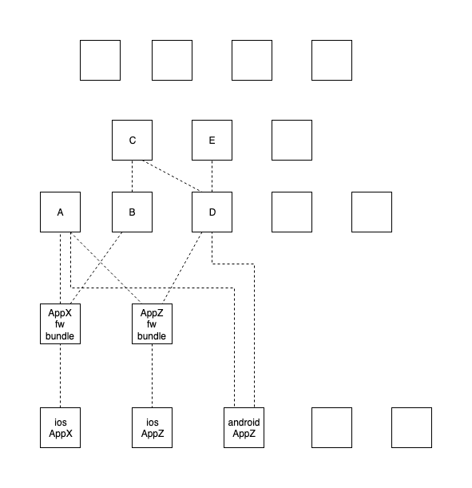
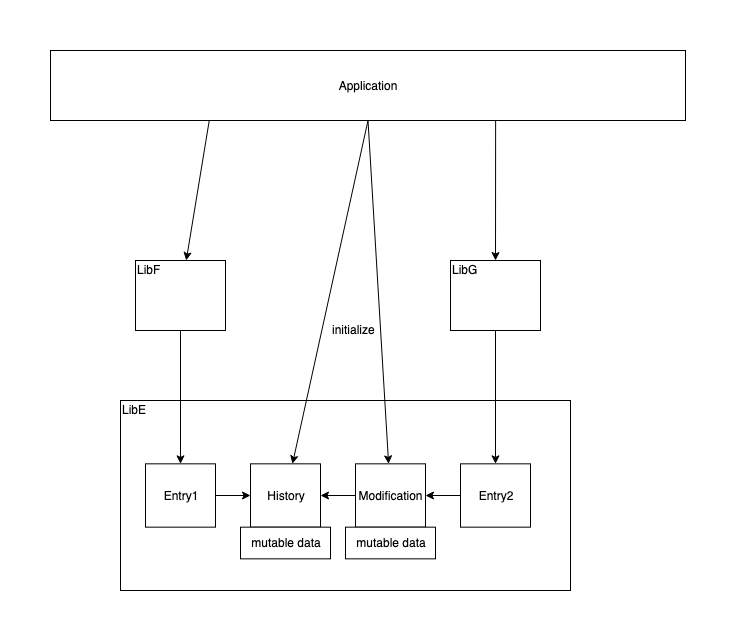

# khtf
Umbrella project for multiproject kotlin template.


This project setup aim to simplify crossplatform development with Kotlin.

Sometimes there is need for multiple apps on multiple platforms with shared business logic.
Using modular architecture, it is possible to reuse most of the business logic.

Structure should be good to be used internally in single organization. Providing structure for public artifacts is not the purpose of this project.


What could be shared (some examples):

* algorithms
  * image processing
  * serialization to custom formats
* communication with backend (endpoints)
* collecting user analytics
* common UI
  * user feedback
  * news and announcements
  * support contact
  * company brand colors and fonts
* social sharing

This example is structured as independent repositories. When multiple teams develop multiple apps, it is important for them to rely on specific versions of functionality.
Each module could be build and released as new version independently from others.

All repositories here could be separated into 4 layers:

1. Libs with common code only. 
2. Libs with common and native code.
3. Framework repositories, that combine multiple kotlin libs into single framework. Only needed for iOS.
4. Applications (ios, android, backend, desktop, etc), that use libs.




## List of sub projects

* AndroidApp - Android app, that uses kotlin libraries (usually few steps behind iOS app)
  * https://github.com/ekahau/khtf-androidapp
* IosApp - iOS app that uses IosAppFw framework (via cocoapods) to import kotlin libraries
  * https://github.com/Ekahau/khtf-iosapp
* IosAppFw - combine multiple kotlin libraries into single framework
  * https://github.com/Ekahau/khtf-iosapp-fw
* IosAppFwFramework - repository for compiled framework artifact, that could be used in iOs app
  * https://github.com/Ekahau/khtf-iosapp-fw
* podspec - cocoapods repository (aka catalog of available frameworks and locations where they are stored)
  * https://github.com/Ekahau/khtf-podspec
* Libs:
  * A, B, C - simple example to show how nested libs could be accessed from ioas/anddroid apps
    * https://github.com/Ekahau/khtf-lib-a
    * https://github.com/Ekahau/khtf-lib-b
    * https://github.com/Ekahau/khtf-lib-c
  * E, F, G -  example of indirect initialization of classes with provided parameters
    * https://github.com/Ekahau/khtf-lib-e
    * https://github.com/Ekahau/khtf-lib-f
    * https://github.com/Ekahau/khtf-lib-g
  * H,I - 
 
 
### E, F, G example

This example show case, where there are multiple paths to create objects.
 
Lets assume that initialization of History and Modification services (from LibE) are expensive and we don't want to do it until we really want to use them. 

iosApp have example, with 2 buttons. Depending on each button, initialization sequence is different.  



This allow developers of libs and apps to not worry, of the exact initialization and object creation order.

E.g.:

```
//in any order
HistoryServiceFactoryKt.setDefaultHistoryServiceData(initialValue: "Monday")
ModificationServiceFactoryKt.setDefaultModificationServiceData(mod1: "a", mod2: "b")

//when any of the above services required,the will be initialized in correct order
LibFCase().doSomething()
```

Note: cyclic dependencies are not supported

## Thoughts

Each library may require complex initialization and dependencies for its classes/objects. Developer who use library should do minimal work to be able to use it. Library maybe called from different threads on iOS, and from different entry points. 

E.g. If library is need 20 singletons to operate internally, user don't have to create them manually in the code. He should be able to only pass required parameters.

If library provided multiple semi-independent functions, single app may use only one part of it. It means that there could be multiple ways to initialized internal services. It shouldn't be on users shoulders to understand how library work internally.


## Limitations

### Resource export propagation (iOS)

Currently kotlin does not support export resources with klib. 

Some possible alternatives:

1. export resources in each library as separate jar package. In FW project, gradle script could go through them and add to result framework.

E.g. structure: 

```
/resources
  /liba
    /file-from-lib-a.txt
  /libb
    /file-from-lib-b.txt
  /libc
    /images
      /btn-save.png
      /btn-close.png
    /config.json
```

2. Get resources from corresponding jar files. May be not very trivial for multiple nested libraries.

3. Adjust how kotlin compile each lib, so resources are also exported.
 
### Only one kotlin framework is allowed (iOS)

If multiple kotlin frameworks added to ios project, then app will fail to start.

Workaround: 

Create extra repository, that could compile all dependent libs into single framework.

Note: If multiple libs expose Class with same name, then compiled names will only differ with '\_' character.  E.g. "MyKotlinClass" and "MyKotlinClass_". It may become hard to distinguish them in ios code.

 
